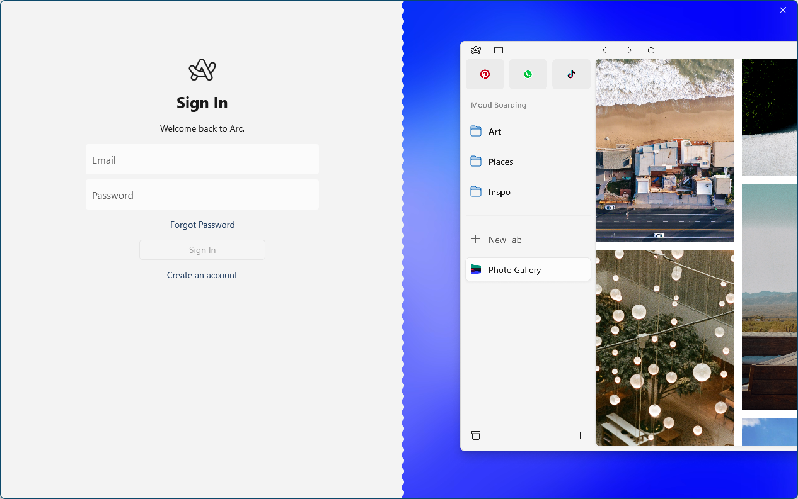
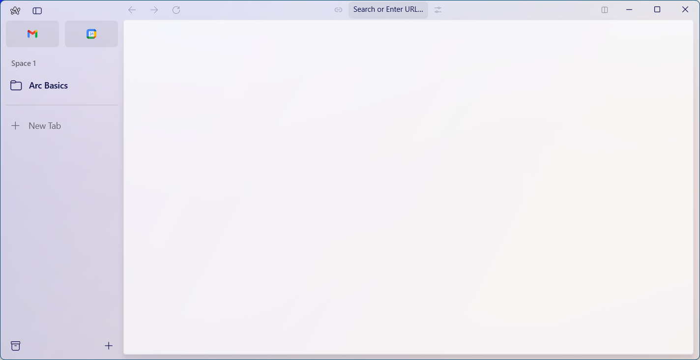

# install_arc

Web ブラウザ「Arc」のインストール方法

[Arc - 初回起動](https://github.com/hsmt72k/install_arc/assets/115420934/e84ea3d0-2d48-4600-8eaa-5d7c32a40f85)

ブラウザを初回起動したら、右矢印ボタンをクリックする。

アカウント登録画面でアカウントを登録する。

登録したアカウントでサインインを行う。

ブラウザが開く。

